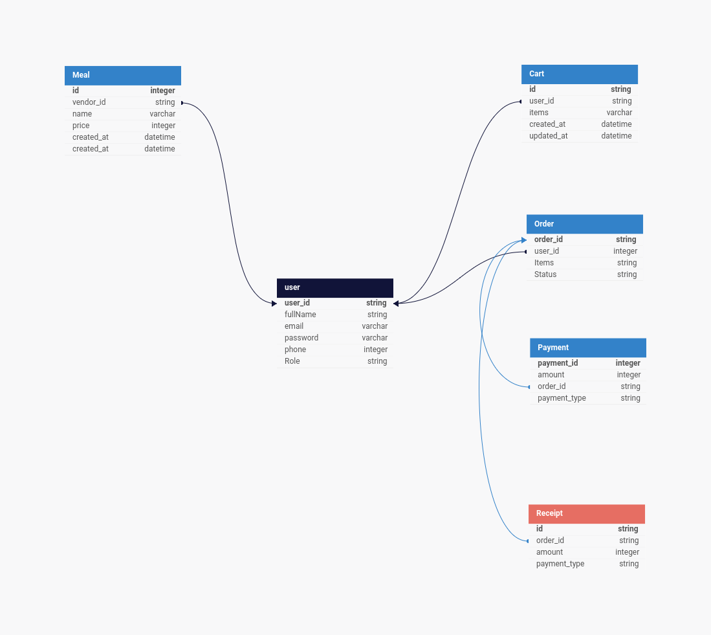

# Bellefull Food Ordering App Integeration API document
The Belleful Food Ordering App API provides a seamless experience for customers to order their favorite meals. This API offers endpoints for managing user accounts, browsing available meals, placing orders, and tracking delivery status.

## Version: 1.0.0

**Contact information:**  
contact@bellefull.app  

**License:** [Apache 2.0](https://www.apache.org/licenses/LICENSE-2.0.html)

## Database Schema
<!-- Image -->


### /auth/signup

#### POST
##### Summary:

Register a new user

##### Description:

Register a new user account with the Bellefull Food Ordering App

##### Request Body
```json
{
  "full_name": "string",
  "email": "string",
  "bussiness_name": "string", // Required for vendors
  "password": "string",
  "role": "string" // Enum: ["customer", "vendor", "admin"  ]
}
```

##### Responses

| Code | Description |
| ---- | ----------- |
| 201 | User registration successful |
| 400 | Invalid request body |
| 409 | User already exists |

```json
{
  "status": true,
  "message": "User registration successful",
  "data": {
    "session": {
      "accessToken": "string",
      "refreshToken": "string"
    },
    "user": {
      "id": "string",
      "full_name": "string",
      "email": "string",
      "role": "string"
    }
  }
}
```

### /auth/login

#### POST
##### Summary:

Authenticate a user

##### Description:

Authenticate a user with the Bellefull Food Ordering App

##### Request Body

```json
{
  "email": "string",
  "password": "string"
}
```

##### Responses

| Code | Description |
| ---- | ----------- |
| 200 | User authenticated successfully |
| 400 | Invalid request body |
| 401 | Unauthorized |

```json
{
  "status": true,
  "message": "User authenticated successfully",
  "data": {
    "session": {
      "accessToken": "string",
      "refreshToken": "string"
    },
    "user": {
      "id": "string",
      "full_name": "string",
      "email": "string",
      "role": "string"
    }
  }
}
```

### /auth/recover-password

#### POST
##### Summary:

Recover user password

##### Description:

Send a password recovery email to the user

##### Request Body

```json
{
  "email": "string"
}
```

##### Responses

| Code | Description |
| ---- | ----------- |
| 200 | Password recovery email sent |
| 400 | Invalid request body |
| 404 | User not found |

```json
{
  "status": true,
  "message": "Password recovery email sent"
}
```

### /customers

#### GET
##### Summary:

Get all customers

##### Description:

Retrieve a list of all customers registered with the Bellefull Food Ordering App. This endpoint is only accessible to admin users.

##### Request Headers

| Name | Description | Required |
| ---- | ----------- | -------- |
| Authorization | Bearer token | Yes |

##### Responses

| Code | Description |
| ---- | ----------- |
| 200 | List of customers retrieved successfully |

```json
{
  "status": true,
  "message": "List of customers retrieved successfully",
  "data": [
    {
      "id": "string",
      "full_name": "string",
      "email": "string"
    }
  ]
}
```

#### POST
##### Summary:

Create a new customer

##### Description:

Register a new customer account with the Bellefull Food Ordering App. This endpoint is only accessible to admin users.

##### Request Headers
| name | description | required |
| ---- | ----------- | -------- |
| Authorization | Bearer token | Yes |

##### Responses

| Code | Description |
| ---- | ----------- |
| 201 | Customer registration successful |
| 400 | Invalid request body |
| 409 | Customer already exists |

```json
{
  "status": true,
  "message": "Customer registration successful",
  "data": {
    "id": "string",
    "full_name": "string",
    "email": "string"
  }
}
```

### /customers/{customerId}

#### GET
##### Summary:

Get customer details

##### Description:

Retrieve details of a specific customer. This endpoint is only accessible to admin users.

##### Parameters

| Name | Located in | Description | Required | Schema |
| ---- | ---------- | ----------- | -------- | ---- |
| customerId | path | ID of the customer to retrieve | Yes | integer |

##### Request Headers

| Name | Description | Required |
| ---- | ----------- | -------- |
| Authorization | Bearer token | Yes |

##### Responses

| Code | Description |
| ---- | ----------- |
| 200 | Customer details retrieved successfully |
| 404 | Customer not found |

```json
{
  "status": true,
  "message": "Customer details retrieved successfully",
  "data": {
    "id": "string",
    "full_name": "string",
    "email": "string"
  }
}
```

#### PUT
##### Summary:

Update customer details

##### Description:

Update details of a specific customer

##### Parameters

| Name | Located in | Description | Required | Schema |
| ---- | ---------- | ----------- | -------- | ---- |
| customerId | path | ID of the customer to update | Yes | integer |

##### Request Headers

| Name | Description | Required |
| ---- | ----------- | -------- |
| Authorization | Bearer token | Yes |

##### Responses

| Code | Description |
| ---- | ----------- |
| 200 | Customer details updated successfully |
| 400 | Invalid request body |
| 404 | Customer not found |

```json
{
  "status": true,
  "message": "Customer details updated successfully"
}
```

#### DELETE
##### Summary:

Delete a customer

##### Description:

Delete a specific customer account

##### Parameters

| Name | Located in | Description | Required | Schema |
| ---- | ---------- | ----------- | -------- | ---- |
| customerId | path | ID of the customer to delete | Yes | integer |

##### Request Headers

| Name | Description | Required |
| ---- | ----------- | -------- |
| Authorization | Bearer token | Yes |

##### Responses

| Code | Description |
| ---- | ----------- |
| 204 | Customer deleted successfully |
| 404 | Customer not found |

```json
{
  "status": true,
  "message": "Customer deleted successfully"
}
```

### /vendors

#### GET
##### Summary:

Get all vendors

##### Description:

Retrieve a list of all vendors registered with the Bellefull Food Ordering App

##### Responses

| Code | Description |
| ---- | ----------- |
| 200 | List of vendors retrieved successfully |

```json
{
  "status": true,
  "message": "List of vendors retrieved successfully",
  "data": [
    {
      "id": "string",
      "full_name": "string",
      "email": "string",
      "bussiness_name": "string"
    }
  ]
}
```

#### POST
##### Summary:

Create a new vendor

##### Description:

Register a new vendor account with the Bellefull Food Ordering App. This endpoint is only accessible to admin users.

##### Request Headers

| Name | Description | Required |
| ---- | ----------- | -------- |
| Authorization | Bearer token | Yes |

##### Responses

| Code | Description |
| ---- | ----------- |
| 201 | Vendor registration successful |
| 400 | Invalid request body |
| 409 | Vendor already exists |

### /vendors/{vendorId}

#### GET
##### Summary:

Get vendor details

##### Description:

Retrieve details of a specific vendor

##### Parameters

| Name | Located in | Description | Required | Schema |
| ---- | ---------- | ----------- | -------- | ---- |
| vendorId | path | ID of the vendor to retrieve | Yes | integer |

##### Responses

| Code | Description |
| ---- | ----------- |
| 200 | Vendor details retrieved successfully |
| 404 | Vendor not found |

```json
{
  "status": true,
  "message": "Vendor details retrieved successfully",
  "data": {
    "id": "string",
    "full_name": "string",
    "email": "string",
    "bussiness_name": "string"
  }
}
```

#### PUT
##### Summary:

Update vendor details

##### Description:

Update details of a specific vendor

##### Parameters

| Name | Located in | Description | Required | Schema |
| ---- | ---------- | ----------- | -------- | ---- |
| vendorId | path | ID of the vendor to update | Yes | integer |

##### Request Body
```json
{
  "full_name": "string",
  "email": "string",
  "bussiness_name": "string"
}
```

##### Responses

| Code | Description |
| ---- | ----------- |
| 200 | Vendor details updated successfully |
| 400 | Invalid request body |
| 404 | Vendor not found |

```json
{
  "status": true,
  "message": "Vendor details updated successfully"
}
```

#### DELETE
##### Summary:

Delete a vendor

##### Description:

Delete a specific vendor account

##### Parameters

| Name | Located in | Description | Required | Schema |
| ---- | ---------- | ----------- | -------- | ---- |
| vendorId | path | ID of the vendor to delete | Yes | integer |

##### Responses

| Code | Description |
| ---- | ----------- |
| 204 | Vendor deleted successfully |
| 404 | Vendor not found |

```json
{
  "status": true,
  "message": "Vendor deleted successfully"
}
```

### /meals

#### GET
##### Summary:

Get all meals

##### Description:

Retrieve a list of all available meals from vendors

##### Responses

| Code | Description |
| ---- | ----------- |
| 200 | List of meals retrieved successfully |

```json
{
  "status": true,
  "message": "List of meals retrieved successfully",
  "data": [
    {
      "id": "string",
      "name": "string",
      "price": "number",
      "vendor": {
        "id": "string",
        "full_name": "string",
        "bussiness_name": "string"
      }
    }
  ]
}
```

#### POST
##### Summary:

Add a new meal

##### Description:

Add a new meal to the list of available meals

##### Responses

| Code | Description |
| ---- | ----------- |
| 201 | Meal added successfully |
| 400 | Invalid request body |

### /meals/{mealId}

#### GET
##### Summary:

Get meal details

##### Description:

Retrieve details of a specific meal

##### Parameters

| Name | Located in | Description | Required | Schema |
| ---- | ---------- | ----------- | -------- | ---- |
| mealId | path | ID of the meal to retrieve | Yes | integer |

##### Responses

| Code | Description |
| ---- | ----------- |
| 200 | Meal details retrieved successfully |
| 404 | Meal not found |

```json
{
  "status": true,
  "message": "Meal details retrieved successfully",
  "data": {
    "id": "string",
    "name": "string",
    "price": "number",
    "vendor": {
      "id": "string",
      "full_name": "string",
      "bussiness_name": "string"
    }
  }
}
```

#### PUT
##### Summary:

Update meal details

##### Description:

Update details of a specific meal

##### Parameters

| Name | Located in | Description | Required | Schema |
| ---- | ---------- | ----------- | -------- | ---- |
| mealId | path | ID of the meal to update | Yes | integer |

##### Request Headers


##### Responses

| Code | Description |
| ---- | ----------- |
| 200 | Meal details updated successfully |
| 400 | Invalid request body |
| 404 | Meal not found |

#### DELETE
##### Summary:

Delete a meal

##### Description:

Delete a specific meal from the list of available meals

##### Parameters

| Name | Located in | Description | Required | Schema |
| ---- | ---------- | ----------- | -------- | ---- |
| mealId | path | ID of the meal to delete | Yes | integer |

##### Responses

| Code | Description |
| ---- | ----------- |
| 204 | Meal deleted successfully |
| 404 | Meal not found |

### /cart

#### GET
##### Summary:

Get shopping cart

##### Description:

Retrieve the current shopping cart of the authenticated user

##### Responses

| Code | Description |
| ---- | ----------- |
| 200 | Shopping cart retrieved successfully |

#### POST
##### Summary:

Add item to cart

##### Description:

Add a new item to the shopping cart

##### Responses

| Code | Description |
| ---- | ----------- |
| 201 | Item added to cart successfully |
| 400 | Invalid request body |

### /cart/{itemId}

#### PUT
##### Summary:

Update cart item

##### Description:

Update details of a specific item in the shopping cart

##### Parameters

| Name | Located in | Description | Required | Schema |
| ---- | ---------- | ----------- | -------- | ---- |
| itemId | path | ID of the item in the cart to update | Yes | integer |

##### Responses

| Code | Description |
| ---- | ----------- |
| 200 | Cart item updated successfully |
| 400 | Invalid request body |
| 404 | Item not found in cart |

#### DELETE
##### Summary:

Remove item from cart

##### Description:

Remove a specific item from the shopping cart

##### Parameters

| Name | Located in | Description | Required | Schema |
| ---- | ---------- | ----------- | -------- | ---- |
| itemId | path | ID of the item in the cart to remove | Yes | integer |

##### Responses

| Code | Description |
| ---- | ----------- |
| 204 | Item removed from cart successfully |
| 404 | Item not found in cart |

### /orders

#### GET
##### Summary:

Get all orders

##### Description:

Retrieve a list of all orders placed by the authenticated user

##### Responses

| Code | Description |
| ---- | ----------- |
| 200 | List of orders retrieved successfully |

#### POST
##### Summary:

Place a new order

##### Description:

Place a new order with the selected items in the shopping cart

##### Responses

| Code | Description |
| ---- | ----------- |
| 201 | Order placed successfully |
| 400 | Invalid request body |

### /orders/{orderId}

#### GET
##### Summary:

Get order details

##### Description:

Retrieve details of a specific order

##### Parameters

| Name | Located in | Description | Required | Schema |
| ---- | ---------- | ----------- | -------- | ---- |
| orderId | path | ID of the order to retrieve | Yes | integer |

##### Responses

| Code | Description |
| ---- | ----------- |
| 200 | Order details retrieved successfully |
| 404 | Order not found |

#### PUT
##### Summary:

Update order status

##### Description:

Update the status of a specific order

##### Parameters

| Name | Located in | Description | Required | Schema |
| ---- | ---------- | ----------- | -------- | ---- |
| orderId | path | ID of the order to update | Yes | integer |

##### Responses

| Code | Description |
| ---- | ----------- |
| 200 | Order status updated successfully |
| 400 | Invalid request body |
| 404 | Order not found |

#### DELETE
##### Summary:

Cancel an order

##### Description:

Cancel a specific order

##### Parameters

| Name | Located in | Description | Required | Schema |
| ---- | ---------- | ----------- | -------- | ---- |
| orderId | path | ID of the order to cancel | Yes | integer |

##### Responses

| Code | Description |
| ---- | ----------- |
| 204 | Order canceled successfully |
| 404 | Order not found |

### /payments

#### POST
##### Summary:

Process payment

##### Description:

Process payment for a specific order

##### Responses

| Code | Description |
| ---- | ----------- |
| 200 | Payment processed successfully |
| 400 | Invalid request body |

### /admin/users

#### GET
##### Summary:

Get all users

##### Description:

Retrieve a list of all users registered with the Bellefull Food Ordering App

##### Responses

| Code | Description |
| ---- | ----------- |
| 200 | List of users retrieved successfully |

### /admin/users/{userId}

#### GET
##### Summary:

Get user details

##### Description:

Retrieve details of a specific user

##### Parameters

| Name | Located in | Description | Required | Schema |
| ---- | ---------- | ----------- | -------- | ---- |
| userId | path | ID of the user to retrieve | Yes | integer |

##### Responses

| Code | Description |
| ---- | ----------- |
| 200 | User details retrieved successfully |
| 404 | User not found |

#### PUT
##### Summary:

Update user details

##### Description:

Update details of a specific user

##### Parameters

| Name | Located in | Description | Required | Schema |
| ---- | ---------- | ----------- | -------- | ---- |
| userId | path | ID of the user to update | Yes | integer |

##### Responses

| Code | Description |
| ---- | ----------- |
| 200 | User details updated successfully |
| 400 | Invalid request body |
| 404 | User not found |

#### DELETE
##### Summary:

Delete a user

##### Description:

Delete a specific user account

##### Parameters

| Name | Located in | Description | Required | Schema |
| ---- | ---------- | ----------- | -------- | ---- |
| userId | path | ID of the user to delete | Yes | integer |

##### Responses

| Code | Description |
| ---- | ----------- |
| 204 | User deleted successfully |
| 404 | User not found |
